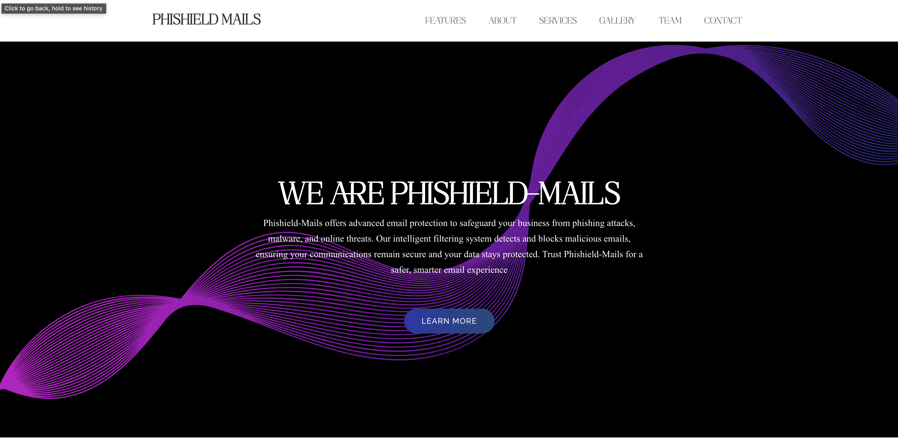

# Phishield Mails ✉️🛡️

## Tech Stack 🛠️

- **Frontend:** ReactJS, JavaScript, HTML, CSS, Bootstrap, Google Fonts
- **Backend:** Node.js, Express.js, Google OAuth, Gmail API, Google Generative AI (Gemini-1.5)
- **Utilities:** dotenv for environment configuration, Base64 data handling, Cors, Morgan for logging

---

## Phishield Mails ✉️🛡️

A sophisticated web application built to detect and manage email spam threats using AI-based filtering and classification. Designed with a sleek and user-friendly interface, this system efficiently handles email analysis, categorization, and management, providing a seamless experience for users. Phishield Mails combines AI-powered backend capabilities with a beautiful frontend, focusing on security and ease of use.

## Features of Phishield Mails 🚀

- **User-Friendly Interface:** A modern and intuitive frontend with easy navigation for analyzing emails, spam detection, and accessing services.
  
  - **Below Images Show Dashboard and Additional Features:**
  
    - **Service Overview**
      

    - **AI-Driven Email Analysis**
      

- **Backend Integration:** A powerful backend built with Express, Node.js, and AI integration to classify emails and detect potential spam.

- **Spam Detection:** Utilizes AI to classify emails based on content and sender, providing accurate spam scores and reasons.

- **Interactive Dashboard:** An interactive dashboard that provides real-time analysis and insights into email data, enhancing user interaction.

- **Email Management:** View, categorize, and manage emails effortlessly with AI-backed predictions for spam filtering.

- **Team Section & Gallery:** A dedicated section showcasing the team behind Phishield Mails and an image gallery of key events and achievements.

- **Contact Us:** A fully integrated contact page for user queries, ensuring easy communication with the Phishield Mails support team.

## About Phishield Mails 🏢

Phishield Mails is developed to ensure email security and manage unwanted spam efficiently. Leveraging AI, the system analyzes email content, identifies spam threats, and provides actionable insights. Users can easily navigate the application, get spam analysis results, and contact the support team for any issues.

The application not only enhances email security but also focuses on user experience with an engaging and interactive UI. It seamlessly combines AI analysis with everyday email management tasks, making spam detection more efficient and reliable.

## Contact Information 📞

Need assistance or have a query? Reach out to the Phishield Mails team through our dedicated contact section. Our support staff is available to help you with any concerns regarding email analysis, spam detection, or general inquiries.

We aim to provide prompt and reliable support, ensuring that you have a seamless experience with Phishield Mails.

## Technologies Used 🛠️

### Frontend

- **ReactJS**
- **JavaScript**
- **HTML & CSS**
- **Bootstrap**
- **Google Fonts** for aesthetic typography

### Backend

- **Node.js**
- **Express.js**
- **Google OAuth Integration:** For secure login and access to Gmail.
- **Google Generative AI Integration:** AI-powered spam classification using the Gemini-1.5 model.
- **Gmail API:** To fetch and manage email data securely.
- **Environment Configuration:** Using `dotenv` for secure environment variables.
- **Base64 Data Handling:** Decoding and processing email content for spam analysis.
- **Cors & Morgan:** For smooth API request handling and logging.

## License 🏆

This repository is licensed under the MIT License. For more details, please refer to the [LICENSE](LICENSE).

Explore the power of AI-backed email management with Phishield Mails, ensuring secure and spam-free communication!
